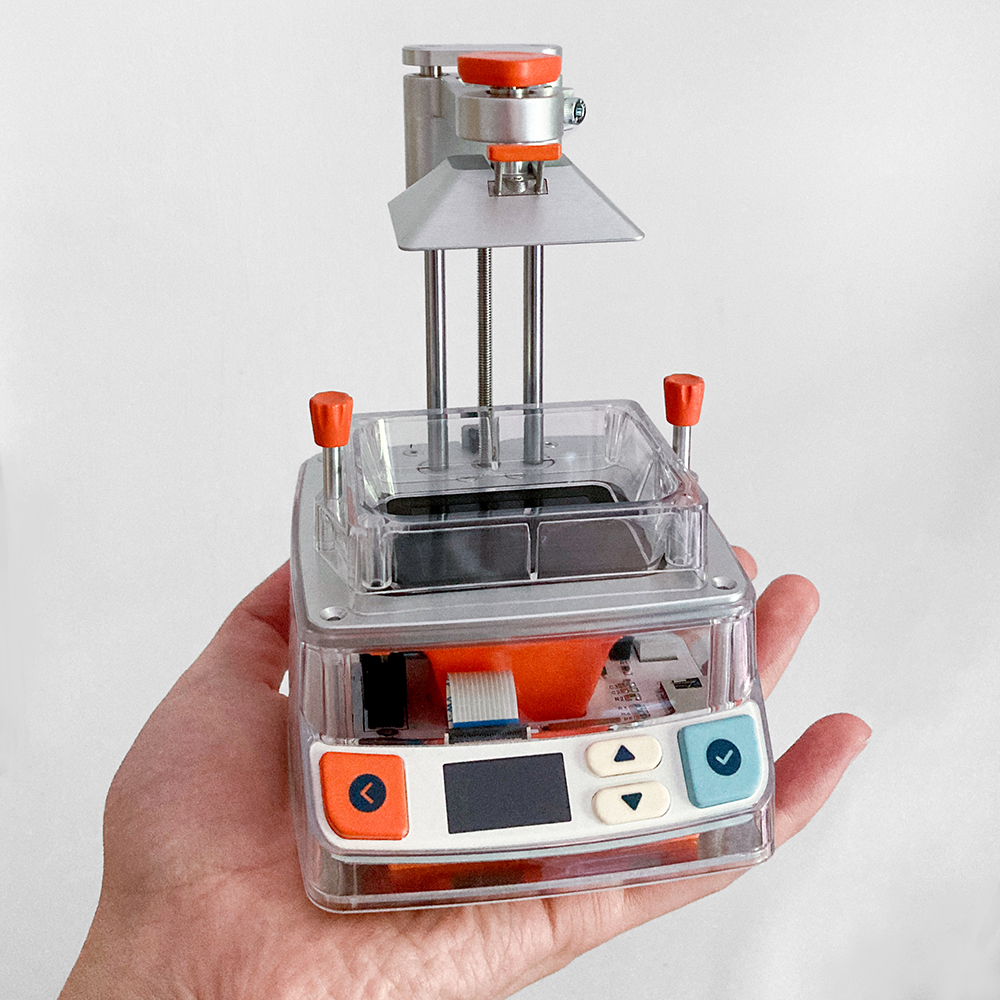
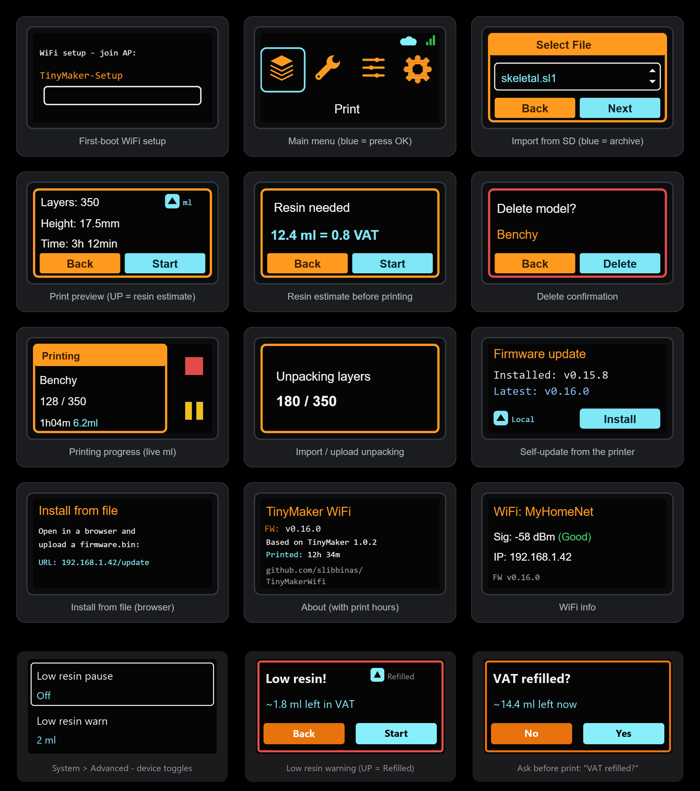
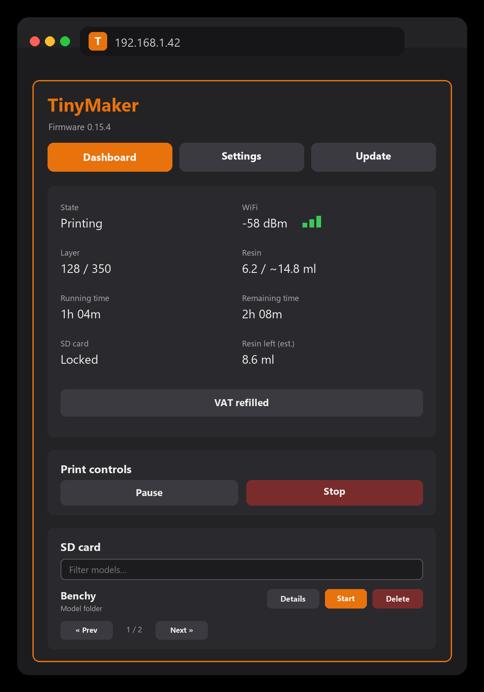
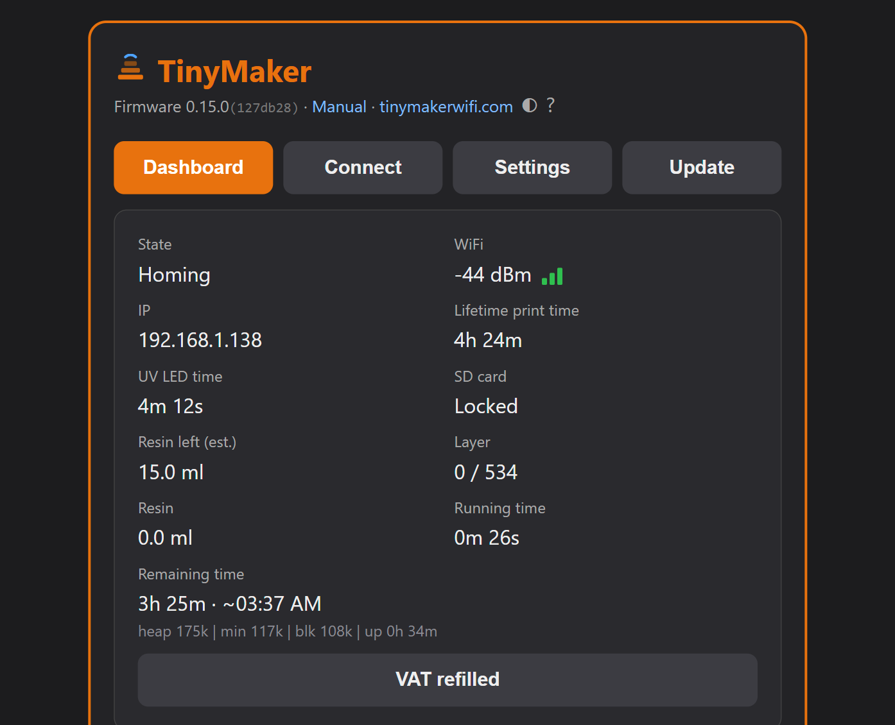
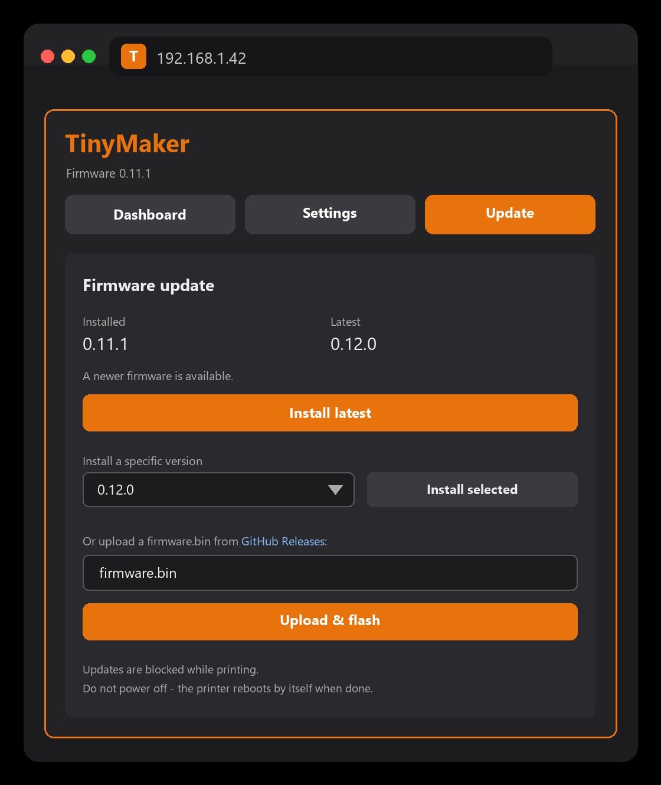

# TinyMakerWifi

Modified and extended firmware for the open-source **TinyMaker** MSLA resin 3D printer. The main additions: **WiFi connectivity**, **OTA updates**, and **direct model upload from PrusaSlicer** — no more SD card shuffling.



🌐 **[tinymakerwifi.com](https://tinymakerwifi.com)** — the project site: what the firmware does, how to get started, community links and an *Open my printer* shortcut.

📖 **[Illustrated user manual](https://slibbinas.github.io/TinyMakerWifi/manual/)** — step by step from the first flash to Home Assistant, with screenshots and an FAQ. Also one tap away from the printer's dashboard (the *Manual* link in the header).

📝 **[Changelog](CHANGELOG.md)** — what each version added and who contributed it, in plain language.

## Features

* **WiFi setup via captive portal** — no credentials in code, configured from your phone on first boot
* **Direct upload from PrusaSlicer** ("Send to printer" button) — the printer emulates the Prusa SL1 network protocol
* Automatic unpacking of uploaded `.sl1` / `.zip` files into the layer format the stock firmware expects (works with both PrusaSlicer and UVtools numbering)
* New **System** menu on the printer: WiFi Info (SSID, signal, IP, reset), **Advanced** settings, firmware Update, About
* **Advanced menu on the printer** — screen timeout, dry run, the resin-tracking controls (VAT refilled, low-resin pause, warn threshold, ask-refill) and **WiFi / Web control on-off switches**, all without a computer *(contributed by [@Briadark](https://github.com/Briadark))*
* WiFi status indicator (green/grey dot) on the main menu
* **Model deletion from the printer** — long-press OK on a model in the Print menu
* **Import from SD card** — copy an `.sl1`/`.zip` onto the card and it shows up in the Print menu (in blue); press OK to convert it into a printable model. Works without any network, the archive is removed after a successful import
* **Lifetime print-hours & UV LED hours counters** — the About screen shows total printing time and total LED-on time (the LED ages by lit time; dry runs don't count). Stored in NVS, survives firmware updates
* **Settings backup & restore** — one file holds every setting and the lifetime counters: download it, keep it on the SD card, and after a full USB reflash the printer offers to restore everything on first boot. The dashboard shows the SD backup's date and has a one-click **Restore from SD**
* **Boot update check** — shortly after WiFi connects at boot the printer checks for new firmware and offers *Install / Later* right on the screen (switchable) *(contributed by [@Briadark](https://github.com/Briadark))*
* **Boot animations** — pick the animation the printer plays at power-on (System → Advanced → Boot animation, or in the dashboard) and install new ones straight from the community site *(contributed by [@Tann2019](https://github.com/Tann2019))*
* **Exposure calibration test** — cures an 8-bar test strip straight from the printer (System → Advanced), each bar a different exposure; no slicer or SD file needed
* **Clean Resin Vat** (Maintenance) — full-screen UV exposure cures a thin skin over the vat so debris lifts out in one piece (stock TinyMaker feature, kept and counted into LED hours)
* **Resin usage estimate** — press UP on the print preview to estimate the resin a model needs — shown in ml AND in vat fills (e.g. `12.4 ml = 0.8 VAT`; vat size adjustable 10–40 ml in Settings, default 15). Live ml is shown while printing
* **Resin level tracking** — the printer keeps an estimate of how much resin is left in the VAT, warns before starting a print with too little, and can optionally pause mid-print for a refill (see [Resin level & refills](#resin-level--refills))
* **3D model preview in the dashboard** — open a model's details and press *Preview 3D*: the browser rebuilds the shape from the sliced layers and draws it inside the printer's build-volume box, so you can tell models apart without printing them
* **3D print progress** — while printing, the dashboard shows the same 3D view filling up in real time: the printed part in color, the rest as a ghost outline. Zero load on the printer (the browser renders from prefetched layers)
* **WiFi reset** — from the System menu, or by holding the BACK button while powering on
* **Web dashboard** — open the printer's IP in a browser: SD manager (upload/delete/start), live print status with pause/resume/stop and finish-time estimate, device config and a dry-run test mode *(initial version contributed by [@Briadark](https://github.com/Briadark))*
* **MQTT / Home Assistant** — optional integration with auto-discovery: print state, layers, resin used, **resin left + low-resin alert**, run/remaining time as HA sensors
* **Telegram notifications** — the printer messages your phone when a print **finishes** (with time and resin used), **pauses for low resin**, or is **canceled**. One On/Off switch, a bot token and a chat id — with a *Send test* button and inline setup steps right in the dashboard
* **Firmware updates over WiFi** — self-update from the printer (System → Update) or from the dashboard's **Update tab** (install latest, pick **any version** from a list, or upload a file). PlatformIO OTA for developers. Flashing is blocked while printing.
* Everything is switchable: WiFi and Web control can be turned off right on the printer (System → Advanced), and build switches still let developers compile the original, network-free firmware from the same code base

## Screens

The small status display drives the whole UI — first-boot WiFi setup, wireless upload, resin estimate and guarding, device toggles, and self-update:



## Hardware

Stock TinyMaker electronics — **ESP32-WROOM-32E-N4** (4 MB flash, no PSRAM). No hardware modifications required; WiFi is already on the module.

## Initial Firmware Installation

If you are installing this firmware for the first time, you need to flash it via USB. After this one-time step, all future updates can be done wirelessly via your browser.

### 1. Install Drivers (if needed)
Modern browsers and Windows usually detect the CH340 USB chip automatically. If your computer does **not** recognize the printer when connected via USB, install the CH340 driver from the `Driver` folder of this repository:
* Run `CH341SER.EXE`.

### 2. Download the firmware
Download the latest **`firmware-full.bin`** from the [Releases](https://github.com/slibbinas/TinyMakerWifi/releases) section of this repository.

> ⚠️ **Which file do I need?** Releases contain two files and they are NOT interchangeable:
>
> | File | Used for | How |
> |---|---|---|
> | **`firmware-full.bin`** | **First-time USB flashing** (this section) | Flash Download Tool, address **`0x0`** |
> | `firmware.bin` | Wireless updates **only**, after this firmware is already installed | Browser, `http://tinymaker.local/update` |
>
> Flashing `firmware.bin` over USB will **not** work correctly: it lacks the bootloader and partition table, so the printer either won't boot (if flashed at `0x0`) or OTA updates will be broken (if flashed at `0x10000` over the stock firmware).

### 3. Flash it — Option A: web tool (recommended, no install)

The easiest way — works straight from a Chrome/Edge browser, no drivers or software to install *(thanks to the community for the tip)*:

1. Open **[https://esptool.spacehuhn.com/](https://esptool.spacehuhn.com/)** in Chrome or Edge.
2. Click **Connect** and select your printer's serial port (if unsure which one it is, unplug and replug the USB cable and watch which entry appears).
3. **Remove all pre-filled entries** in the list.
4. Click **ADD**, upload your **`firmware-full.bin`**, and make sure its address field is set to **`0`**.
5. Click **Program**, wait for it to finish, and power cycle the printer.

### 3. Flash it — Option B: Espressif Flash Download Tool (Windows)

If you prefer the official desktop tool:

1. Get **`flash_download_tool.zip`** from the `Flash_Installer` folder of this repo (or the official [Espressif Flash Download Tool](https://docs.espressif.com/projects/esp-test-tools/en/latest/esp32/production_stage/tools/flash_download_tool.html) page). **Extract the ZIP fully before running.**
2. Run the extracted `flash_download_tool_xxx.exe`.
3. In the "Download Tool" window, select **ESP32** and **Develop** mode.
4. Configure the settings **exactly** as follows (wrong settings are the most common cause of a non-booting printer):
    * **SPI Speed:** 40 MHz
    * **SPI Mode:** DIO
    * **Flash Size:** 32 Mbit (4MB)
5. Click the three dots `...` next to the first row and select **`firmware-full.bin`** (not `firmware.bin`!).
6. In the address field next to the file, enter **`0x0`** (zero — not `0x10000`).
7. Ensure the checkbox on the left of the file path is **checked** — without it the tool flashes nothing and still reports success.
8. Select the correct **COM port**, click **START**, and power cycle the printer when it says "FINISH".

Note: the first boot after flashing may take a few seconds longer than usual, and the printer will start the `TinyMaker-Setup` WiFi access point (see below). Printer settings (exposure, layer height, etc.) reset to factory defaults.

## First WiFi setup

1. Power on the printer. On first boot it starts a **`TinyMaker-Setup`** access point.
2. Connect to it with your phone — a captive portal opens automatically (or browse to `http://192.168.4.1`).
3. Select your home WiFi network and enter the password.
4. The printer connects and briefly shows its IP address; credentials are stored, so next boots connect automatically (~5 s). If the saved network is unreachable, the printer simply boots in offline mode after 15 s — printing from SD works as always.


WiFi status, signal strength and IP are always visible under **System → WiFi Info**.

### Resetting WiFi

Two ways to erase the stored credentials (e.g. when moving the printer to another network):

* **From the menu:** System → WiFi Info → press OK → confirm. The printer erases the credentials, reboots and starts the `TinyMaker-Setup` portal again.
* **Emergency reset:** hold the **BACK** button while powering the printer on. Use this if the printer keeps trying to connect to an old network and you can't reach the menu in time.

## PrusaSlicer setup

1. Import the TinyMaker printer profile (`TinyMaker.ini`, in this repo) via *File → Import → Import Config*.
2. Add a **physical printer**: click the cog icon next to the printer profile → *Add physical printer*:
   * **Name:** anything (e.g. `TinyMaker WiFi`)
   * **Hostname, IP or URL:** `tinymaker.local` (or the printer's IP shown in System → WiFi Info)
   * **API Key:** any text (not verified)
   * Note: The printer emulates the Prusa SL1 network protocol.
3. Click **Test** — it should report a successful connection (printer must be on and connected to WiFi).
4. Slice and press **Send to printer**. The printer shows *Receiving → Unpacking → Model ready*, and the model appears in the **Print** menu.

<p>
  
  &nbsp;
  
</p>

**Always slice with the 0.05 mm profile.** Unlike FDM, the printed layer height is set **on the printer** (Settings → Layer Height), not by the sliced file — the file is just a stack of 0.05 mm images, and at the 0.10 mm printer setting the firmware takes every other image. Maximum model size: 1200 layers = 60 mm.

## Importing models from the SD card

No network? Copy an `.sl1` or `.zip` (exported by PrusaSlicer/UVtools) into the **root** of the SD card. It appears in the **Print** menu in **blue** among the models — press **OK** to convert it (progress is shown). When done, the new model appears in the list and the archive is deleted from the card. Long-press OK on a blue entry deletes the archive without importing.

## Deleting uploaded models

In the **Print** menu, **press and hold OK for ~1.5 seconds** on a model — a *Delete model?* confirmation appears (release the button first, then **OK = Delete**, **Back = No**). Deletion removes the whole model folder from the SD card and shows a progress bar (large models take a while — hundreds of layer files). A short OK press starts printing as usual.

## Web dashboard

Open the printer's IP address in any browser for the full dashboard *(initial version contributed by [@Briadark](https://github.com/Briadark))*: live print status and controls, SD card management with one-click start/import, device settings, backups and firmware updates — all in tabs styled to match the printer's UI.



On a desktop-sized screen the dashboard spreads into two columns — here it is in real use, idle with a card full of models:


### 3D preview & live print progress

Every model on the SD card can be previewed in 3D — the browser rebuilds the shape from the sliced layers (the printer only streams a few dozen small files) and draws it inside the build-volume box. Start the print from the dashboard and the same view turns into a **live progress render**: the printed part fills in with color, the unprinted rest stays a ghost outline. Works offline, no libraries, and costs the printer nothing while printing.

A real print in progress — a plate of teeth with supports, rendered live in the build-volume box:



## Advanced menu (WiFi and Web control switches)

**System → Advanced** on the printer *(contributed by [@Briadark](https://github.com/Briadark))* holds the device toggles — OK changes a value, Back returns:

| Item | What it does |
|---|---|
| Screen timeout | Blank the status screen after 30 s…10 min of inactivity (Off = never) |
| Dry run | Test prints without UV — motion and display only |
| VAT refilled | Press after refilling resin — restarts the level estimate from a full VAT |
| Low resin pause | On = the print pauses for a refill when the estimate runs low |
| Low resin warn | The warning/pause threshold, 1–3 ml (OK cycles) |
| Ask refill | On = every print starts with a "VAT refilled?" question (Yes resets the estimate to a full VAT). Turn Off if you press *VAT refilled* yourself |
| **WiFi** | **On/Off — the whole network** (web, PrusaSlicer upload, MQTT, self-update) |
| Web control | On/Off — browser **actions**. Off = the dashboard turns view-only (watch, but no print control, SD changes, uploads, settings or firmware updates); slicer upload and MQTT/HA keep working |
| MQTT | On/Off (shown once MQTT is configured in the dashboard) |

How the network switches behave:

* **WiFi Off** makes the printer fully offline, like the original firmware. Toggling WiFi asks *"Reboot now?"* — OK reboots and applies it immediately, Back applies it on the next power-up. Everything network-related disappears from the menus until WiFi is back on — **turning it back on is done right here (System → Advanced → WiFi)**, no reflash or reset needed.
* **Web control Off** makes the dashboard **view-only**: anyone on the network can still open it and watch the print (status, layers, resin left, SD contents, model details), but every action — print stop/pause, SD delete/upload, resin estimate, settings, VAT refilled, firmware updates — is disabled with a clear banner. PrusaSlicer/UVtools "Send to printer" and MQTT/Home Assistant keep working. Turning it back on is done on the printer (System → Advanced), since the settings form is among the things it locks.
* If WiFi is off and you open **System → Update**, the printer offers to enable WiFi temporarily just for the update.
* WiFi and Web control are also in the dashboard's Settings tab (with a confirmation — unchecking Web control locks you out of settings until it is re-enabled on the printer, and turning WiFi off from the browser reboots the printer).

Both switches default to **On**, and stay On after upgrading from an older version — nothing changes until you change it.

## Resin level & refills

The printer has no resin sensor — instead it **keeps count**: every printed layer's cured volume (the same white-pixel estimate used for the ml counter) is subtracted from the VAT level. The estimate survives reboots and firmware updates.

* **"Resin left (est.)"** is shown on the dashboard; in Home Assistant it appears as a *Resin left* sensor plus a *Resin low* alert you can automate notifications on.
* **After refilling**, tell the printer: **System → Advanced → VAT refilled** on the printer, or the **VAT refilled** button on the dashboard. The estimate restarts from a full VAT (your VAT size setting).
* **Ask refill** (default On): every print begins with a *"VAT refilled?"* question — on the printer (OK = yes / Back = no) and in the browser — so the estimate stays honest even if you forget the button. Tidy users can turn it off (System → Advanced or dashboard Settings); the low-resin warning screen then still offers **UP = Refilled** as a shortcut.
* **While printing** the dashboard shows resin like layers: `used / ~total ml` (total = the fresh estimate when you ran one, otherwise a running average) plus *Resin left (est.)* in the VAT.
* **Before a print starts**, if the level is at/below the warning threshold (or a fresh ml estimate says the model needs more than what's left), the printer shows **"Low resin!"** with the numbers — Start anyway or Back. Starting from the browser asks the same in a dialog.
* **Low resin pause** (optional, default Off): mid-print, when the level drops to the threshold, the printer finishes the layer, lifts and pauses showing **"Refill VAT!"** — refill, press VAT refilled (dashboard) or just resume. The threshold (`Low resin warn`, 1–3 ml, default 2) is set on the printer (System → Advanced) or in the dashboard's Settings tab.

> ⚠️ It is an **estimate**, not a measurement — it doesn't account for resin sticking to models or drips, so treat it as a planning aid and glance at the real VAT now and then. Refills you don't confirm with "VAT refilled" won't be counted.

## Wireless Firmware Updates

> 🔒 Firmware flashing is **blocked while the printer is printing**, and the web paths require **Web control** to be on. (Model upload from PrusaSlicer is separate — it works any time.)

Three ways to update:

* **On the printer (self-update, no computer):** `System → Update` shows the **installed** version and checks GitHub for the **latest**. If a newer one is available, the `Install` button lights up — press **OK** and the printer downloads and flashes it itself over WiFi.
* **From the dashboard — the Update tab:** shows installed vs latest with an **Install latest** button, a **version picker** (install any released version, downgrades ask for confirmation) and a **file upload** for a `firmware.bin` from [Releases](https://github.com/slibbinas/TinyMakerWifi/releases) or a local build.
* **For developers:** PlatformIO OTA — open `System → Update` on the printer (this path keeps the strict screen gate), then select the `env:tinymaker-ota` environment and Upload goes over WiFi.

Do not power off during an update — and don't worry too much either: the dual OTA partition keeps the previous firmware if the update fails.




> The self-update needs the latest `firmware.bin` + a `version.txt` hosted on GitHub Pages. See [`Firmware_Hosting/`](Firmware_Hosting/) for the one-time setup and per-release steps.

## Building from source

Requirements: [VS Code + PlatformIO](https://platformio.org/).

1. Clone this repo.
2. Unpack the four vendor-verified libraries from `Firmware/Libraries/*.zip` of the original project into the `lib/` folder: `AccelStepper` (1.64), `Arduino_GFX` (1.2.0), `PNGdec` (1.0.1), `SdFat` (1.1.2). **Do not use newer versions from the registry** — the APIs changed.
3. `pio run` — the platform (`espressif32@6.5.0`, Arduino core 2.x) and the network libraries (WiFiManager, unzipLIB) are fetched automatically. Do not upgrade to Arduino core 3.x.
4. First flash goes over USB (`env:tinymaker`, CH340 serial); after that OTA works (`env:tinymaker-ota`).

Build switches at the top of the main `.ino` — **developers only**. To simply
turn WiFi off, use **System → Advanced → WiFi** on the printer instead; the
compile-time switch exists for building a binary with no network code at all:

```cpp
#define ENABLE_NETWORK       1   // 0 = original firmware behavior, no network code compiled in
#define ENABLE_SERIAL_DEBUG  1   // 0 = no serial output
```

## Support this project

If you find this project useful and want to support my work, you can [buy me a coffee via PayPal](https://paypal.me/Sidlauskas?locale.x=en_US&country.x=LT).

## Credits & Acknowledgements

* **Original project:** [TinyMaker-Open-Source-3D-Printer](https://github.com/TinyMaker3D/TinyMaker-Open-Source-3D-Printer)
* **Original authors:** TinyMaker3D Team

## License

This project retains the original dual licensing of the TinyMaker3D project:

* **Firmware:** MIT License
* **Hardware:** CC BY-NC-SA 4.0

See `LICENSE.md` for full details and copyright notices.