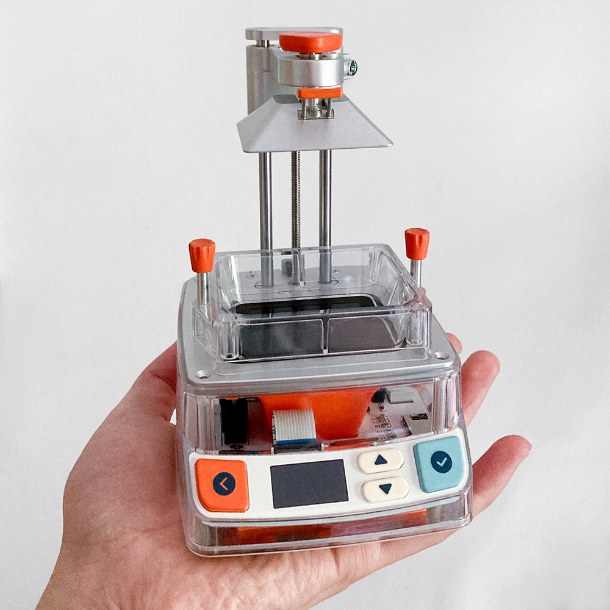
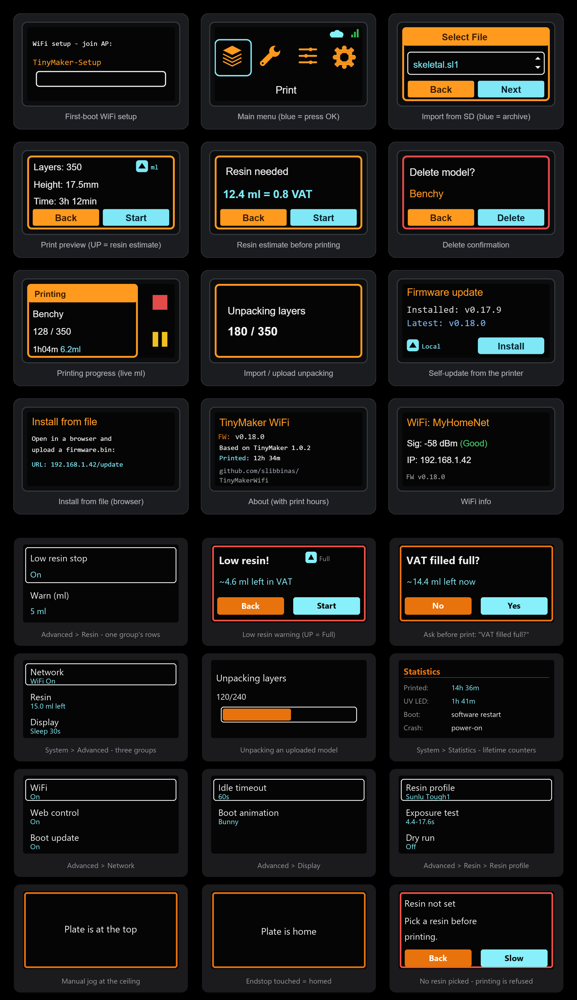
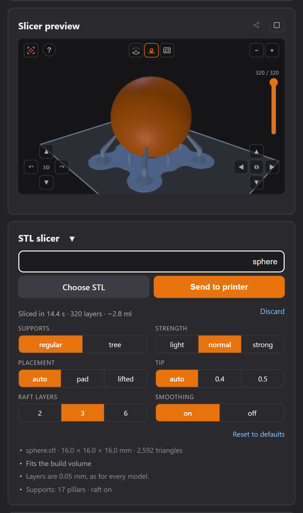
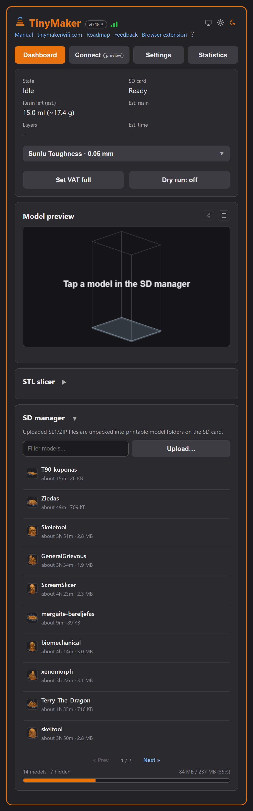
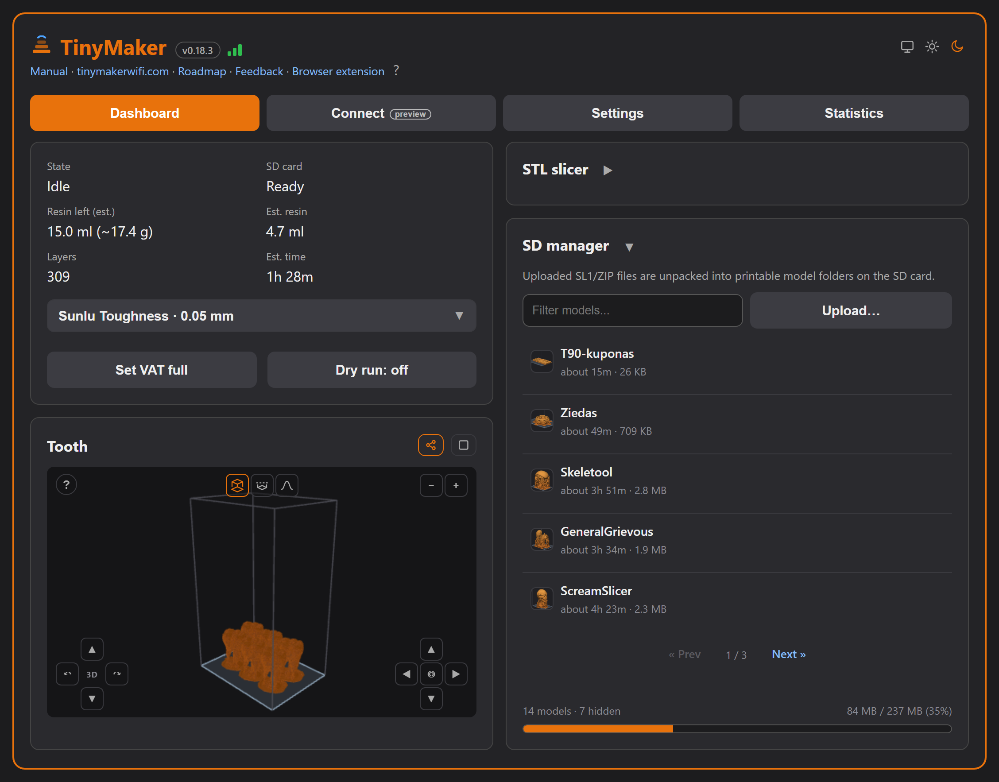
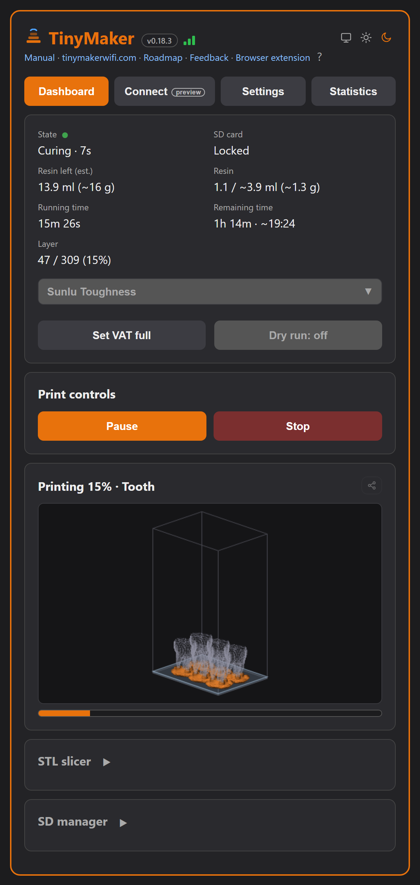
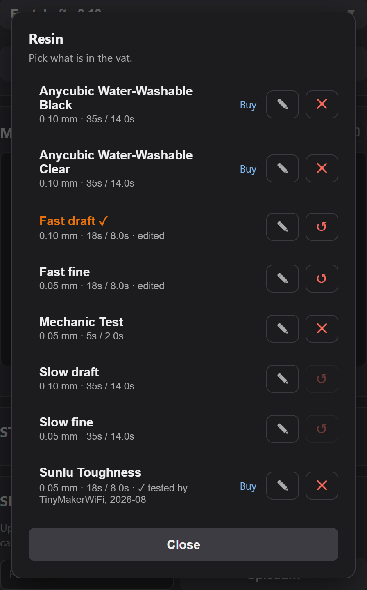
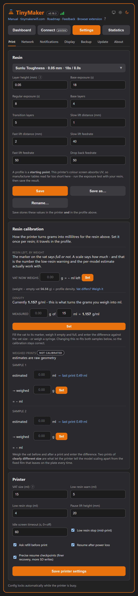
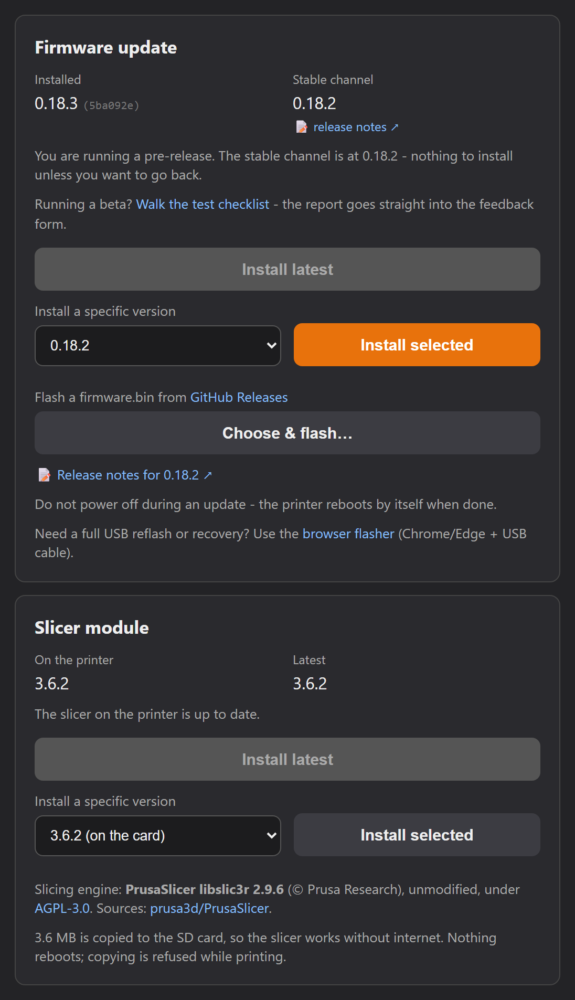

# TinyMakerWifi

Modified and extended firmware for the open-source **TinyMaker** MSLA resin 3D printer. The main additions: **WiFi connectivity**, **OTA updates**, and **direct model upload from PrusaSlicer** — no more SD card shuffling.



🌐 **[tinymakerwifi.com](https://tinymakerwifi.com)** — the project site: what the firmware does, how to get started, community links and an *Open my printer* shortcut.

🧪 **[Live demo](https://tinymakerwifi.com/demo/)** — the real web dashboard driving a simulated printer: start a print, watch the 3D progress, poke through Settings. Nothing to install, no printer needed.

📖 **[Illustrated user manual](https://slibbinas.github.io/TinyMakerWifi/manual/)** — step by step from the first flash to Home Assistant, with screenshots and an FAQ. Also one tap away from the printer's dashboard (the *Manual* link in the header).

📝 **[Changelog](CHANGELOG.md)** — what each version added and who contributed it, in plain language.

💬 **[Feedback](https://tinymakerwifi.com/feedback/)** — what works, what doesn't, what's missing. Photos welcome, no account needed; the dashboard header links it too.

## Features

* **WiFi setup via captive portal** — no credentials in code, configured from your phone on first boot
* **Direct upload from PrusaSlicer** ("Send to printer" button) — the printer emulates the Prusa SL1 network protocol
* Automatic unpacking of uploaded `.sl1` / `.zip` files into the layer format the stock firmware expects (works with both PrusaSlicer and UVtools numbering)
* New **System** menu on the printer: WiFi Info (SSID, signal, IP, reset), **Advanced** settings, firmware Update, About
* **Advanced menu on the printer** — screen timeout, dry run, the resin-tracking controls (VAT refilled, low-resin pause, warn threshold, ask-refill) and **WiFi / Web control on-off switches**, all without a computer *(contributed by [@Briadark](https://github.com/Briadark))*
* WiFi status indicator (green/grey dot) on the main menu
* **Model deletion from the printer** — long-press OK on a model in the Print menu
* **Import from SD card** — copy an `.sl1`/`.zip` onto the card and it shows up in the Print menu (in blue); press OK to convert it into a printable model. Works without any network, the archive is removed after a successful import
* **Lifetime print-hours & UV LED hours counters** — the About screen shows total printing time and total LED-on time (the LED ages by lit time; dry runs don't count). Stored in NVS, survives firmware updates
* **Settings backup & restore** — one file holds every setting and the lifetime counters: download it, keep it on the SD card, and after a full USB reflash the printer offers to restore everything on first boot. The dashboard shows the SD backup's date, has a one-click **Restore from SD**, and can optionally **auto-backup to TinyMaker Connect** *(contributed by [@Briadark](https://github.com/Briadark))*
* **Boot update check** — shortly after WiFi connects at boot the printer checks for new firmware and offers *Install / Later* right on the screen (switchable) *(contributed by [@Briadark](https://github.com/Briadark))*
* **Boot animations** — pick the animation the printer plays at power-on (System → Advanced, or staged in the dashboard and applied with *Save config*), preview it with **Show** right on the printer's screen, install new ones one-click from the **Default library** or the community site, or **Shuffle** a random one each boot *(base contributed by [@Tann2019](https://github.com/Tann2019))*
* **Power-loss recovery** — the printer checkpoints its progress to a tiny file on the SD card while printing; after a power blip or outage it offers **Resume** right on the next boot and picks the print back up at the interrupted layer (no re-homing — the plate is trusted where it stopped)
* **Exposure calibration test** — cures an 8-bar test strip straight from the printer (System → Advanced), each bar a different exposure; no slicer or SD file needed
* **Clean Resin Vat** (Maintenance) — full-screen UV exposure cures a thin skin over the vat so debris lifts out in one piece (stock TinyMaker feature, kept and counted into LED hours)
* **Named resin profiles** — one resin, one recipe: layer height, both exposures, base and transition layers, all four lift settings, and the resin’s density with its weighing calibration. Switching resin is one press instead of ten fields. Two profiles are **built into the firmware** (so the list is never empty - no SD card, no network, after a factory reset), and a **library of ready-made profiles** can be installed from the picker; a “✓ tested by” badge means someone actually printed with that resin on this printer. Pick the resin from the dashboard’s main view, from Settings → Print, or at the machine under System → Advanced → Resin
* **Resin usage estimate** — press UP on the print preview to estimate the resin a model needs — shown in ml AND in vat fills (e.g. `12.4 ml = 0.8 VAT`; vat size adjustable 10–40 ml in Settings, default 15). Live ml is shown while printing
* **Resin level tracking** — the printer keeps an estimate of how much resin is left in the VAT, warns before starting a print with too little, and can optionally pause mid-print for a refill (see [Resin level & refills](#resin-profiles-level--refills))
* **Model preview in the dashboard** — click any SD model: the browser rebuilds the shape from the sliced layers and draws it in the **Model preview** card as a smooth, GPU-rendered 3D model (three.js, cached on the SD card — falls back to the built-in renderer without it), with a compact info line (layers, height, time, resin) and a quick `~ml` resin estimate — click it to run the exact scan. A **Detailed** button re-renders at full print resolution (about a minute per model the first time, instant afterwards — the result is cached next to the model). The card's title names the model it is showing and is a link back to it in the SD list — including while printing, when the title reads *Printing 42% · Tooth*
* **Slice in the browser** — the dashboard slices STL files itself: choose an STL, get supports and a raft, preview the result in 3D and 2D/UV, and send it to the SD card ready to print. The slicer module is fetched once, kept on the SD card (survives firmware updates, works offline afterwards) and every byte is verified against checksums the printer fetches over certificate-checked HTTPS
* **Safe model uploads** — uploads unpack into a temporary folder and replace the old model only after unpacking succeeds; a name conflict asks *Replace / Rename / Cancel* (PrusaSlicer re-uploads just replace) *(contributed by [@Briadark](https://github.com/Briadark))*
* **3D print progress** — while printing, the dashboard shows the same 3D view filling up in real time: the printed part in color, the rest as a ghost outline. Zero load on the printer (the browser renders from prefetched layers)
* **WiFi reset** — from the System menu, or by holding the BACK button while powering on
* **Web dashboard** — open the printer's IP in a browser: SD manager (upload/delete/start), live print status with pause/resume/stop and finish-time estimate, device config and a dry-run test mode — with a **light/dark theme**, a dismissible **Getting Started** checklist, contextual **?** help next to the tricky settings, an always-on **Model preview** card (remembers the last previewed model) and a **PWA manifest** so the dashboard pins to a phone's home screen with the project icon *(initial version contributed by [@Briadark](https://github.com/Briadark))*
* **Power-loss resume** — a checkpoint on the SD card lets the printer pick a print back up after an outage instead of starting over, or safely lift the plate off a stuck print (up only, never into the vat). Answer the prompt at the printer **or from the dashboard on your phone** — a first for a resin printer in this class *(checkpoint engine contributed by [@Tann2019](https://github.com/Tann2019))*
* **MQTT / Home Assistant** — optional integration with auto-discovery: print state, layers, resin used, **resin left + low-resin alert**, run/remaining time as HA sensors
* **Telegram, WhatsApp or Discord notifications** — the printer messages you when a print **finishes** (with time and resin used), **pauses for low resin**, or is **canceled**. Pick one channel: a Telegram bot, WhatsApp through the free CallMeBot gateway, or a Discord channel webhook — each with inline **?** setup help and a *Send test* button. *(Telegram is tested daily; WhatsApp and Discord ship untested — they ride on your own CallMeBot key or channel webhook, so the only test that proves anything is yours. Reports welcome, working or not.)*
* **Anonymous usage ping** (optional) — once per firmware version the printer sends a one-way hash of its MAC address, the firmware version and the lifetime print hours, so we know how many printers are out there. Nothing else is sent, ever — switch it off under Settings → Network → *Anonymous usage ping*
* **Firmware updates over WiFi** — self-update from the printer (System → Update) or from the dashboard's **Settings → Update** pane (install latest, pick **any version** from a list, or upload a file). PlatformIO OTA for developers. Flashing is blocked while printing.
* Everything is switchable: WiFi and Web control can be turned off right on the printer (System → Advanced), and build switches still let developers compile the original, network-free firmware from the same code base

## Screens

The small status display drives the whole UI — first-boot WiFi setup, wireless upload, resin estimate and guarding, device toggles, and self-update:



## Hardware

Stock TinyMaker electronics — **ESP32-WROOM-32E-N4** (4 MB flash, no PSRAM). No hardware modifications required; WiFi is already on the module.

## Installing the firmware

Three ways to get the firmware onto the printer — the first is by far the easiest.

### Method 1: Web flasher (recommended)

**[connect.tinymakerwifi.com/flash.php](https://connect.tinymakerwifi.com/flash.php)** flashes the latest release straight from your browser — nothing to download or install *(contributed by [@Briadark](https://github.com/Briadark))*:

1. Connect the printer to your computer via USB.
2. Open the web flasher in **Chrome or Edge** (they support Web Serial; Firefox/Safari don't).
3. Click **Connect** and select the printer's serial port (unsure which? unplug/replug the USB cable and watch which entry appears).
4. Flash — the tool fetches the latest release itself. Power cycle the printer when it finishes.

If your computer does **not** recognize the printer over USB, install the CH340 driver from the `Driver` folder of this repository (`CH341SER.EXE`), then try again.

#### Flashing fails with `ERROR: Timeout`?

If the flasher connects, downloads the firmware and then dies partway through **Writing firmware-full.bin**, the transfer speed is almost always the culprit - not the browser:

1. **Lower the baud rate.** The **Baud rate** dropdown on the flasher page defaults to `921600`. Set it to **115200** and flash again. It takes a few minutes instead of ~30 seconds, but it tolerates marginal cables and USB-serial chips far better.
2. **Swap the USB cable.** Charge-only cables and cables with thin data lines are the second most common cause. Use a short, known-good data cable.
3. **Plug straight into the computer**, not through a hub, dock, monitor or keyboard port.
4. **Update the CH340 driver** (see above) - an old Windows-bundled driver produces exactly this symptom.
5. **Several ports in the picker?** Unplug the printer, reopen the port picker, plug it back in, and choose the entry that appears.

Still stuck after all five? Open an [issue](https://github.com/slibbinas/TinyMakerWifi/issues) with the flasher log and the baud rate you used.

### Method 2: Already running TinyMakerWifi? Update over WiFi

No USB needed — use `System → Update` on the printer or the dashboard's **Settings → Update** pane. See [Wireless Firmware Updates](#wireless-firmware-updates).

### Method 3: Manual flashing (fallback & developers)

Download the latest **`firmware-full.bin`** from the [Releases](https://github.com/slibbinas/TinyMakerWifi/releases) section of this repository.

> ⚠️ **Which file do I need?** Releases contain two files and they are NOT interchangeable:
>
> | File | Used for | How |
> |---|---|---|
> | **`firmware-full.bin`** | **First-time USB flashing** (this section) | USB flash tool, address **`0x0`** |
> | `firmware.bin` | Wireless updates **only**, after this firmware is already installed | Browser, `http://tinymaker.local/update` |
>
> Flashing `firmware.bin` over USB will **not** work correctly: it lacks the bootloader and partition table, so the printer either won't boot (if flashed at `0x0`) or OTA updates will be broken (if flashed at `0x10000` over the stock firmware).

**Option A: generic web esptool** — [https://esptool.spacehuhn.com/](https://esptool.spacehuhn.com/) in Chrome/Edge: click **Connect**, pick the port, **remove all pre-filled entries**, click **ADD**, upload your **`firmware-full.bin`** with its address set to **`0`**, then **Program** and power cycle.

**Option B: Espressif Flash Download Tool (Windows)** — if you prefer the official desktop tool:

1. Get **`flash_download_tool.zip`** from the `Flash_Installer` folder of this repo (or the official [Espressif Flash Download Tool](https://docs.espressif.com/projects/esp-test-tools/en/latest/esp32/production_stage/tools/flash_download_tool.html) page). **Extract the ZIP fully before running.**
2. Run the extracted `flash_download_tool_xxx.exe`.
3. In the "Download Tool" window, select **ESP32** and **Develop** mode.
4. Configure the settings **exactly** as follows (wrong settings are the most common cause of a non-booting printer):
    * **SPI Speed:** 40 MHz
    * **SPI Mode:** DIO
    * **Flash Size:** 32 Mbit (4MB)
5. Click the three dots `...` next to the first row and select **`firmware-full.bin`** (not `firmware.bin`!).
6. In the address field next to the file, enter **`0x0`** (zero — not `0x10000`).
7. Ensure the checkbox on the left of the file path is **checked** — without it the tool flashes nothing and still reports success.
8. Select the correct **COM port**, click **START**, and power cycle the printer when it says "FINISH".

Note: the first boot after flashing may take a few seconds longer than usual, and the printer will start the `TinyMaker-Setup` WiFi access point (see below). Printer settings (exposure, layer height, etc.) reset to factory defaults.

## First WiFi setup

1. Power on the printer. On first boot it starts a **`TinyMaker-Setup`** access point.
2. Connect to it with your phone — a captive portal opens automatically (or browse to `http://192.168.4.1`).
3. Select your home WiFi network and enter the password.
4. The printer connects and briefly shows its IP address; credentials are stored, so next boots connect automatically (~5 s) — animated signal bars on the boot screen turn green when connected. If the saved network is unreachable, the printer simply boots in offline mode after 15 s — printing from SD works as always.


WiFi status, signal strength and IP are always visible under **System → WiFi Info**.

### Resetting WiFi

Two ways to erase the stored credentials (e.g. when moving the printer to another network):

* **From the menu:** System → WiFi Info → press OK → confirm. The printer erases the credentials, reboots and starts the `TinyMaker-Setup` portal again.
* **Emergency reset:** hold the **BACK** button while powering the printer on. Use this if the printer keeps trying to connect to an old network and you can't reach the menu in time.

## PrusaSlicer setup

1. Import the TinyMaker printer profile (`TinyMaker.ini`, in this repo) via *File → Import → Import Config*.
   **Then save each of the three presets** — click the floppy-disk icon next to *Print settings*, *Material* and *Printer* and accept the names. Imported presets are temporary until saved, so without this step PrusaSlicer forgets the printer every time you close it, and you start over.
2. Add a **physical printer**: click the cog icon next to the printer profile → *Add physical printer*:
   * **Name:** anything (e.g. `TinyMaker WiFi`)
   * **Hostname, IP or URL:** `tinymaker.local` (or the printer's IP shown in System → WiFi Info)
   * **API Key:** any text (not verified)
   * Note: The printer emulates the Prusa SL1 network protocol.
3. Click **Test** — it should report a successful connection (printer must be on and connected to WiFi).
4. Slice and press **Send to printer**. The printer shows *Receiving → Unpacking → Model ready*, and the model appears in the **Print** menu.

<p>
  
  &nbsp;
  
</p>

**Always slice with the 0.05 mm profile.** Unlike FDM, the printed layer height is set **on the printer** (Settings → Layer Height), not by the sliced file — the file is just a stack of 0.05 mm images, and at the 0.10 mm printer setting the firmware takes every other image. Maximum model size: 1200 layers = 60 mm. If prints come out **flat or the wrong height**, check that PrusaSlicer's *Print settings* still show **0.05 mm** — an update or the wrong preset can silently reset it, and the printer can't detect it from the file.

## Slice in the browser

No slicer installed, and nothing to install: the dashboard slices STL files itself. Open the
**STL slicer** card, choose an STL, let it stand the right way up, then press **Slice**.
Orientation is one press - **Fast fit**, or **Optimal fit**, which searches for the rotation
that needs the fewest supports, the way PrusaSlicer does; **Lay flat**, **Flip over**,
**Tilt 90 deg** and **Rotate 90 deg** are there when you want to decide yourself.

Under those buttons sit six settings, and **Reset** puts them all back: **Supports**
(regular or tree), **Strength**, **Placement**, **Tip**, **Raft** and **Smoothing**.
The raft is counted **in layers, not millimetres**. The file is always sliced at 0.05 mm and
the printer decides how many of those images to expose, so the same setting means different
millimetres at a different layer height. The default is **3 layers**; the choice is 2, 3 or 6.
One layer is not offered any more - the pad does not bond to the part at all. Measured here:
a printed pad comes out about 0.15 mm thicker than asked, so 3 layers lands on the ~0.3 mm a
PrusaSlicer plate gives and lifts off with a spatula without force. A thicker raft costs
resin, not time - unless the part is lifted off the plate: then it adds layers too.

You get the result before anything is sent anywhere: the part on its raft in 3D, layer by
layer in 2D, and the numbers that matter underneath - size, triangles, layer count, supports
and the resin estimate. **Send to printer** then puts it on the SD card, ready to print;
**Discard** throws it away and costs nothing.

The slicer is a **module the printer keeps on its own SD card**: fetched once from our GitHub
Pages, verified byte-for-byte against checksums, and used from the card afterwards - so it
works with no internet and survives firmware updates. Everything is sliced at 0.05 mm, the
same as every other model here.



## Importing models from the SD card

No network? Copy an `.sl1` or `.zip` (exported by PrusaSlicer/UVtools) into the **root** of the SD card. It appears in the **Print** menu in **blue** among the models — press **OK** to convert it (progress is shown). When done, the new model appears in the list and the archive is deleted from the card. Long-press OK on a blue entry deletes the archive without importing.

## Deleting uploaded models

In the **Print** menu, **press and hold OK for ~1.5 seconds** on a model — a *Delete model?* confirmation appears (release the button first, then **OK = Delete**, **Back = No**). Deletion removes the whole model folder from the SD card and shows a progress bar (large models take a while — hundreds of layer files). A short OK press starts printing as usual.

## Web dashboard

Open the printer's IP address in any browser for the full dashboard *(initial version contributed by [@Briadark](https://github.com/Briadark))*: live print status and controls, SD card management with one-click start/import, device settings, backups and firmware updates — all in tabs styled to match the printer's UI.

In a narrow window - a phone, or half a screen - everything is one column:



On a desktop-sized screen it spreads into two columns:



While a print runs, the status card counts the current phase down next to its name — *Curing · 9s* — and a small dot says whether the printer answered just now or is mid-move. That matters on this hardware: one ESP32 drives the screen, the motor, the UV LED and the web server off a single SD card, so the dashboard is served in the gaps between layer moves. A pause of a few seconds with an amber *syncing* mark is the printer working, not the page hanging.

### 3D preview & live print progress

Every model on the SD card can be previewed in 3D — the browser rebuilds the shape from the sliced layers (the printer only streams a few dozen small files) and draws it inside the build-volume box. Start the print from the dashboard and the same view turns into a **live progress render**: the printed part fills in with color, the unprinted rest stays a ghost outline. It costs the printer nothing while printing.

There is no mesh to render — the model reaches the printer already sliced into images, so the shape is rebuilt from the layers themselves. The smooth surface comes from three.js on the GPU; the library is fetched once and then lives on the SD card, so the preview keeps working with no internet. Without the library (or on a browser without WebGL) a built-in canvas renderer takes over: only the surfaces the camera can actually see are drawn, each shaded from a normal estimated out of its neighbourhood, which is what makes blocky voxels read as a rounded object.

A real print in progress — a plate of teeth with supports, rendered live in the build-volume box:



## Advanced menu (WiFi and Web control switches)

**System → Advanced** on the printer *(contributed by [@Briadark](https://github.com/Briadark))* holds the device toggles — OK changes a value, Back returns:

Since 0.16 the items sit in **three groups** - Network, Resin and Display - so the list stays
short at every step, and each group row shows its own state at a glance (`WiFi On`,
`15.0 ml left`, `Sleep 60s`).

**Network**

| Item | What it does |
|---|---|
| **WiFi** | **On/Off - the whole network** (web, PrusaSlicer upload, MQTT, self-update) |
| Web control | On/Off - browser **actions**. Off = the dashboard turns view-only (watch, but no print control, SD changes, uploads or firmware updates) |
| MQTT | On/Off (shown once MQTT is configured in the dashboard) |
| Boot update | On/Off - whether the printer checks for newer firmware shortly after it connects |

**Resin**

| Item | What it does |
|---|---|
| Resin profile | Steps through the installed profiles and applies the one shown - the whole recipe for that resin |
| VAT refilled | Press after refilling - restarts the level estimate from a full VAT |
| Low resin stop | On = mid-print, at *Stop (ml)*, the printer finishes the layer, lifts and pauses for a refill |
| Stop (ml) | The level that stops the print: 1-3 ml (OK cycles) |
| Warn (ml) | The earlier heads-up, on the screen and on your phone: 3 - 5 - 8 - 10 - 12 - 15 ml |
| Ask refill | On = every print starts with a "VAT refilled?" question (Yes resets the estimate to a full VAT) |
| Power resume | On = the printer checkpoints as it prints and offers to resume after a power cut |
| Resume mode | **Balanced** checkpoints every 800 ms of plate movement, **Precise** every 400 ms |
| Pause lift | How high the plate rises when you pause to look at the print: 20-40 mm in 5 mm steps |
| Exposure test | Cures an 8-bar calibration strip around your Regular exposure - resin in the vat, no build plate |
| Dry run | Test prints without UV - motion and display only (the UV stays off *everywhere*, the vat-cleaning cycle included) |

**Display**

| Item | What it does |
|---|---|
| Idle timeout | Blank the status screen after 30 s...10 min of inactivity (Off = never). Only while idle - never mid-print |
| Boot animation | Which animation plays at power-on |

How the network switches behave:

* **WiFi Off** makes the printer fully offline, like the original firmware. Toggling WiFi asks *"Reboot now?"* — OK reboots and applies it immediately, Back applies it on the next power-up. Everything network-related disappears from the menus until WiFi is back on — **turning it back on is done right here (System → Advanced → WiFi)**, no reflash or reset needed.
* **Web control Off** makes the dashboard **view-only**: anyone on the network can still open it and watch the print (status, layers, resin left, SD contents, model details), but every action — print stop/pause, SD delete/upload, resin estimate, settings, VAT refilled, firmware updates — is disabled with a clear banner. PrusaSlicer/UVtools "Send to printer" and MQTT/Home Assistant keep working. Turning it back on is done on the printer (System → Advanced), since the settings form is among the things it locks.
* If WiFi is off and you open **System → Update**, the printer offers to enable WiFi temporarily just for the update.
* WiFi and Web control are also in the dashboard's Settings tab (with a confirmation — unchecking Web control locks you out of settings until it is re-enabled on the printer, and turning WiFi off from the browser reboots the printer).

Both switches default to **On**, and stay On after upgrading from an older version — nothing changes until you change it.

## Resin profiles, level & refills




The printer has no resin sensor — instead it **keeps count**: every printed layer's cured volume (the same white-pixel estimate used for the ml counter) is subtracted from the VAT level. The estimate survives reboots and firmware updates.

* **"Resin left (est.)"** is shown on the dashboard; in Home Assistant it appears as a *Resin left* sensor plus a *Resin low* alert you can automate notifications on.
* **After refilling**, tell the printer: **System → Advanced → VAT refilled** on the printer, or the **VAT refilled** button on the dashboard. The estimate restarts from a full VAT (your VAT size setting).
* **Ask refill** (default On): every print begins with a *"VAT refilled?"* question — on the printer (OK = yes / Back = no) and in the browser — so the estimate stays honest even if you forget the button. Tidy users can turn it off (System → Advanced or dashboard Settings); the low-resin warning screen then still offers **UP = Refilled** as a shortcut.
* **While printing** the dashboard shows resin like layers: `used / ~total ml` (total = the fresh estimate when you ran one, otherwise a running average) plus *Resin left (est.)* in the VAT.
* **Before a print starts**, if the level is at/below the warning threshold (or a fresh ml estimate says the model needs more than what's left), the printer shows **"Low resin!"** with the numbers — Start anyway or Back. Starting from the browser asks the same in a dialog.
* **Low resin pause** (optional, default Off): mid-print, when the level drops to the threshold, the printer finishes the layer, lifts and pauses showing **"Refill VAT!"** — refill, press VAT refilled (dashboard) or just resume. The threshold (`Low resin warn`, 1–3 ml, default 2) is set on the printer (System → Advanced) or in the dashboard's Settings tab.

> ⚠️ It is an **estimate**, not a measurement — it doesn't account for resin sticking to models or drips, so treat it as a planning aid and glance at the real VAT now and then. Refills you don't confirm with "VAT refilled" won't be counted.

## Wireless Firmware Updates

> 🔒 Firmware flashing is **blocked while the printer is printing**, and the web paths require **Web control** to be on. (Model upload from PrusaSlicer is separate — it works any time.)

Three ways to update:

* **On the printer (self-update, no computer):** `System → Update` shows the **installed** version and checks GitHub for the **latest**. If a newer one is available, the `Install` button lights up — press **OK** and the printer downloads and flashes it itself over WiFi.
* **From the dashboard — the Update tab:** shows installed vs latest with an **Install latest** button, a **version picker** (install any released version, downgrades ask for confirmation) and a **file upload** for a `firmware.bin` from [Releases](https://github.com/slibbinas/TinyMakerWifi/releases) or a local build.
* **For developers:** PlatformIO OTA — open `System → Update` on the printer (this path keeps the strict screen gate), then select the `env:tinymaker-ota` environment and Upload goes over WiFi.
* **The browser slicer updates separately.** The same Update tab holds a **Slicer module** card — the version on the printer’s SD card vs the latest published, with its own install button and version picker. A slicer update copies a few megabytes to the card; the printer never reboots for it, and a running print is never interrupted.

Do not power off during an update — and don't worry too much either: the dual OTA partition keeps the previous firmware if the update fails.



> The self-update needs the latest `firmware.bin` + a `version.txt` hosted on GitHub Pages. See [`Firmware_Hosting/`](Firmware_Hosting/) for the one-time setup and per-release steps.

## Building from source

Requirements: [VS Code + PlatformIO](https://platformio.org/).

1. Clone this repo.
2. Unpack the four vendor-verified libraries from `Firmware/Libraries/*.zip` of the original project into the `lib/` folder: `AccelStepper` (1.64), `Arduino_GFX` (1.2.0), `PNGdec` (1.0.1), `SdFat` (1.1.2). **Do not use newer versions from the registry** — the APIs changed.
3. `pio run` — the platform (`espressif32@6.5.0`, Arduino core 2.x) and the network libraries (WiFiManager, unzipLIB) are fetched automatically. Do not upgrade to Arduino core 3.x.
4. First flash goes over USB (`env:tinymaker`, CH340 serial); after that OTA works (`env:tinymaker-ota`).

Build switches at the top of the main `.ino` — **developers only**. To simply
turn WiFi off, use **System → Advanced → WiFi** on the printer instead; the
compile-time switch exists for building a binary with no network code at all:

```cpp
#define ENABLE_NETWORK       1   // 0 = original firmware behavior, no network code compiled in
#define ENABLE_SERIAL_DEBUG  1   // 0 = no serial output
```

## Support this project

If you find this project useful and want to support my work, you can [buy me a coffee via PayPal](https://paypal.me/Sidlauskas?locale.x=en_US&country.x=LT).

## Credits & Acknowledgements

* **The browser slicer's engine** — **PrusaSlicer's `libslic3r` 2.9.6** (© Prusa Research a.s.), compiled to WebAssembly from the **unmodified** upstream sources ([tag `version_2.9.6`](https://github.com/prusa3d/PrusaSlicer/tree/version_2.9.6), commit `b028299`) and used under the **[GNU AGPL-3.0](https://www.gnu.org/licenses/agpl-3.0.html)**. The rest of TinyMakerWifi remains MIT-licensed — the two are separate programs shipped side by side.
* **Original project:** [TinyMaker-Open-Source-3D-Printer](https://github.com/TinyMaker3D/TinyMaker-Open-Source-3D-Printer)
* **Original authors:** TinyMaker3D Team

## License

This project retains the original dual licensing of the TinyMaker3D project:

* **Firmware:** MIT License
* **Hardware:** CC BY-NC-SA 4.0

See `LICENSE.md` for full details and copyright notices.